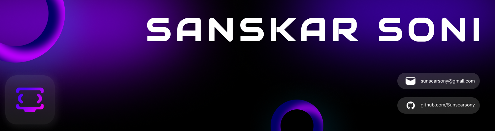

  <a href="https://komarev.com/ghpvc/?username=Sunscar-Sony">
</a>
<br>
<div align="center">
          <a href="https://github.com/Sunscar-Sony">
        </a>
</div>
<div>
    <div align="center">
        <a href="https://github.com/Sunscar-Sony"></a>
    </div>
    &nbsp;&nbsp;&nbsp;&nbsp;&nbsp;
  <a href="https://www.sunscar.me/" target="_blank">
        
  </a>
    <div align="center">
      <a href="https://github.com/Sunscar-Sony">
            
        </a>
    </div>
    <div align="center">
        <a href="https://www.linkedin.com/in/sanskar-s-15b83329a/"></a>
        <a href="mailto:sunscarsony@gmail.com"></a>
    </div>
    <div align="left">
        <br />
        <p>
            <strong>
Aspiring software engineer with a flair for web design and front-end development! Skilled in crafting captivating user experiences with HTML, CSS, JavaScript, React.js, and Next.js. I thrive on creating seamless, intuitive interfaces that bring ideas to life. Always on the hunt for innovative tools and techniques. Let's code something amazing together! 
            </strong>
        </p>
        <h1></h1>
        <ul>
            <li>🔭 <b>I’m currently working on</b>: Bus Tracking and Management System</li>
            <li>🌱 <b>I’m currently learning</b>: Android, Python, Java, Desgining, React JS.</li>
            <li>💬 <b>Ask me about</b>: Web Development, Web Designing</li>
            <li>📫 <b>How to reach me</b>: Catch and follow me from the above links 👆, in addition to follow me here.</li>
            <li>🤔 <b>I’m currently open for</b>: A new Internship opportunity and Open Source Projects.</li>
        </ul>
        <br />
    </div>
</div>

```py
About Me = [
  
I'm a software engineering student passionate about front-end development and UI/UX design.
 Skilled in HTML, CSS, JavaScript, React.js, and Next.js,
I love crafting engaging user experiences and incorporating creative elements like clever Easter eggs.

Outside of coding,
I enjoy experimenting with new recipes and jamming to my favorite playlist.
Let's connect and create something amazing together! 
]
```
<br>
<div align="center">
    <h1>Skill Set &nbsp;  </h1>
    <h4>These technologies represent my expertise and hands-on experience. They've been integral to my work, enabling me to deliver impactful solutions. </h4>
</div>

<!---------------------------------------------------------------------------------------------------------------------------------------------------------->
<!----- Shivam's Tech Stack Table    ----------------------------------------------------------------------------------------------------------------------->
<!---------------------------------------------------------------------------------------------------------------------------------------------------------->

<table>
<div style="display: flex; align-items: flex-start; align: center">
<table align="center">
  <tr>
    <td align="center" width="96">
        
      <br>C++
    </td>
    <td align="center" width="96">
      <a href="https://www.python.org/">
        
      </a>
      <br>Python
    </td>
    <td align="center" width="96">
        
      <br>JavaScript
    </td>
    <td align="center" width="96">
        
      <br>TypeScript
    </td>
    <td align="center" width="96">
        
      <br>Swift
    </td>
    <td align="center" width="96">
        
      <br>Golang
    </td>
    <td align="center" width="96">
        
      <br>MySQL
    </td>
    <td align="center" width="96">
        
      <br>MongoDB
    </td>
    <td align="center" width="96">
        
      <br>PostgreSQL
    </td>
  </tr>
  <tr>
  <td align="center" width="96">
        
      <br>HTML
    <td align="center" width="96">
        
      <br>CSS
    </td>
    <td align="center" width="96"> 
        
      <br>BootStrap
    </td>
    <td align="center"  width="96">
        
      <br>React
    </td>
    <td align="center"  width="96">
        
      <br>Redux
    </td>
    <td align="center" width="96">
        
      <br>NextJS
    </td>
    <td align="center"  width="96">
        
      <br>TailWind CSS
    </td>
    <td align="center" width="96">
        
      <br>Three.js
    </td>
    <td align="center" width="96">
        
      <br>jQuery
    </td>
  </tr>
 <tr>
      <td align="center" width="96">
        
      <br>Github
    </td>
        <td align="center" width="96">
        
      <br>Nodejs
      </td>
      </td>
    <td align="center" width="96">
        
      <br>ExpreeJS
    </td>
            <td align="center" width="96">
        
      <br>Django
    </td>
              <td align="center" width="96">
        
      <br>REST
    </td>
              <td align="center" width="96">
        
      <br>GraphQL
  <td align="center" width="96">
      <a href="#macropower-tech">
        
      </a>
      <br>AWS
    </td>
              <td align="center" width="96">
        
      <br>Docker
    </td>
    <td align="center" width="96">
        
      <br>Kubernetes
    </td>
 </tr>
</table>


<div>
   <div align="center">

#  GitHub Stats

<p align="center">
  <a href="https://github.com/Sunscarsony">
    
  </a>
</p>

<p align="center">
  <a href="https://github.com/Sunscar-Sony">
    
  </a>
</p>

<hr>
</div>
<!-- Skill Set (App Development)  -->
<div align="center">
    <h3><b>Frontend Development</b></h3>
    <code><a href="#" target="_blank"></a></code>&nbsp;
    <code><a href="#" target="_blank"> </a></code>&nbsp;
    <code><a href="#" target="_blank"></a></code>&nbsp;
  
</div>
<br>
<div align="center">
    <h3><b>App Development </b></h3>
    <code><a href="#" target="_blank" rel="noreferrer">  </a></code>&nbsp;
    <code><a href="#" target="_blank" rel="noreferrer">  </a></code>&nbsp;
    <code><a href="#" target="_blank" rel="noreferrer">  </a></code>&nbsp;
    <br>
  
<!-- Skill Set (L&F)  -->
<div align="center">
    <h3><b>Libraries and Frameworks</b></h3>
    <code><a href="#" target="_blank"> </a></code>&nbsp;
      <code><a href="#" target="_blank" rel="noreferrer">  </a></code>
      <code><a href="#" target="_blank"> </a></code>&nbsp;
    <code><a href="#" target="_blank" rel="noreferrer">  </a></code>&nbsp;
    <code><a href="#" target="_blank"></a></code>&nbsp;
</div>
<br>

<!-- Skill Set (Database)  -->
<div align="center">
    <h3><b>Databases</b></h3>
    <code><a href="#" target="_blank" rel="noreferrer"> </a></code>&nbsp;
    <code><a href="#" target="_blank"></a></code>&nbsp;
      <code><a href="#" target="_blank"></a></code>&nbsp;
   <code><a #="#" target="_blank"> </a></code>&nbsp
</div>
<br>

<!-- Skill Set (Cloud)  -->
<div align="center">
    <h3><b>Cloud</b></h3>
    <code><a href="#" target="_blank"></a></code>&nbsp;
    <code><a href="#" target="_blank" rel="noreferrer">  </a></code>&nbsp;
      <code><a href="#" target="_blank" rel="noreferrer">  </a></code>&nbsp;&nbsp;
  <code><a href="#" target="_blank"> </a></code>&nbsp;
<br>

<!-- Skill Set (Tools)  -->
<div align="center">
    <h3><b>Tools</b></h3>
    <code><a href="#" target="_blank"></a></code>&nbsp;
    <code><a href="#" target="_blank"></a></code>&nbsp;
    <code><a href="#" target="_blank"></a></code>&nbsp;
    <code><a href="#" target="_blank"> </a></code>&nbsp;
</div>
<br>

<div align="center">
    <h3><b>Operating Systems</b></h3>
    <code><a href="#" target="_blank"></a></code>&nbsp;
    <code><a href="#" target="_blank"></a></code>&nbsp;
    <code><a href="#" target="_blank" rel="noreferrer">  </a></code>&nbsp;
    <br><br>
</div>
    <br><br>
</div>
</div>
<hr>

<br><br>

<div>
    <br>
</div>

<div>
    <div align="center">
        <a href="https://www.google.com/search?q=How+to+make+my+Internet+Connection+faster+%3F" target="_blank"></a>
        <p>Loading...</p>
    </div>
</div>

